# GANs comparison without cherry-picking

Implementations of some theoretical generative adversarial nets: DCGAN, EBGAN, LSGAN, WGAN, WGAN-GP, BEGAN, and DRAGAN. 

I implemented the structure of model equal to the structure in paper and compared it on the CelebA dataset without cherry-picking.


## Table of Contents

* [Features](#features)
* [Models](#models)
* [Dataset](#dataset)
   * [CelebA](#celeba)
   * [LSUN](#lsun-bedroom)
* [Results](#results)
   * [DCGAN](#dcgan)
   * [EBGAN](#ebgan)
   * [LSGAN](#lsgan)
   * [WGAN](#wgan)
   * [WGAN-GP](#wgan-gp)
   * [BEGAN](#began)
   * [DRAGAN](#dragan)
* [Conclusion](#conclusion)
* [Usage](#usage)
   * [Requirements](#requirements)
* [Similar works](#similar-works)


## Features

- Model architectures are same as the architectures proposed in each paper
- Each model was not much tuned, so the results can be improved
- Well-structured (was my goal at the start, but I don't know whether it succeed!)
    - TensorFlow queue runner is used for input pipeline
    - Single trainer (and single evaluator) - multi model structure
    - Logs in training and configuration are recorded on the TensorBoard

## Models

- DCGAN
- LSGAN
- WGAN
- WGAN-GP
- EBGAN
- BEGAN
- DRAGAN

The family of conditional GANs are excluded (CGAN, acGAN, and so on). 

## Dataset 

### CelebA

http://mmlab.ie.cuhk.edu.hk/projects/CelebA.html

- All experiments were performed on 64x64 CelebA dataset
- The dataset has 202599 images
- 1 epoch consists of about 1.58k iterations for batch size 128

### LSUN bedroom

http://lsun.cs.princeton.edu/2017/

- The dataset has 3033042 images
- 1 epoch consists of about 23.7k iterations for batch size 128

This dataset is provided in [LMDB](http://www.lmdb.tech/) format. https://github.com/fyu/lsun provides documentation and demo code to use it. 

## Results

- I implemented the same as the proposed model in each paper, but ignored some details (or the paper did not describe details of model)
  - Granted, a little details make great differences in the results due to the very unstable GAN training
  - So if you had a better results, let me know the settings 🙂
- Default batch_size=128 and z_dim=100 (from DCGAN)

### DCGAN

Radford, Alec, Luke Metz, and Soumith Chintala. "Unsupervised representation learning with deep convolutional generative adversarial networks." arXiv preprint arXiv:1511.06434 (2015).

- Relatively simple networks
- Learning rate for discriminator (D_lr) is 2e-4 and learning rate for generator (G_lr) is 2e-4 (proposed in the paper) and 1e-3

|                G_lr=2e-4                 |                G_lr=1e-3                 |
| :--------------------------------------: | :--------------------------------------: |
|                   50k                    |                   30k                    |
|  | 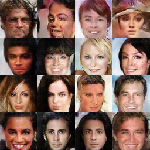 |

Second row (50k, 30k) indicates each training iteration.

Higher learning rate (1e-3) for generator made better results. In this case, however, the generator has been collapsed sometimes due to its large learning rate. Lowering both learning rate may bring stability like https://ajolicoeur.wordpress.com/cats/ in which suggested D_lr=5e-5 and G_lr=2e-4.

|                   LSUN                   |
| :--------------------------------------: |
|                   100k                   |
|  |


### EBGAN

Zhao, Junbo, Michael Mathieu, and Yann LeCun. "Energy-based generative adversarial network." arXiv preprint arXiv:1609.03126 (2016).

- I like energy concept, so this paper is very interesting for me :)
  - But there is criticism: [Are Energy-Based GANs any more energy-based than normal GANs?](http://www.inference.vc/are-energy-based-gans-actually-energy-based/)
- Anyway, the energy concept and autoencoder based loss function are impressive, and the results are also fine
- But I have a question for Pulling-away Term (PT), which prevents mode-collapse theoretically. This is the same idea as minibatch discrimination (T. Salimans et al).


|             pt weight = 0.1              |                No pt loss                |
| :--------------------------------------: | :--------------------------------------: |
|                   30k                    |                   30k                    |
|  |  |

The model using PT generates slightly better sample visually. However, it is not clear from this results whether PT prevents mode-collapse. Furthermore, I could not distinguish what setting is better from repeated experiments.


|             pt weight = 0.1              |                No pt loss                |
| :--------------------------------------: | :--------------------------------------: |
| 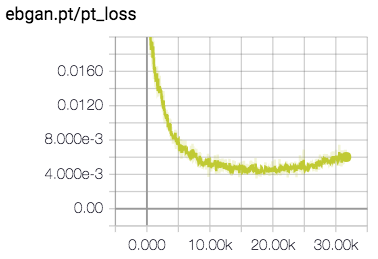 | 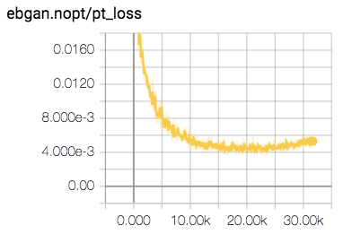 |

pt_loss decreases a little faster in the left which used pt_weight=0.1 but there is no big difference and even at the end the right which used no pt_loss showed a lower pt_loss. So I wonder: is the PT loss really working for preventing mode-collapse as described in the paper?

|                  LSUN                   |
| :-------------------------------------: |
|                   80k                   |
|  |

### LSGAN

Mao, Xudong, et al. "Least squares generative adversarial networks." arXiv preprint ArXiv:1611.04076 (2016).

- Unusually, LSGAN used large latent space dimension (z_dim=1024)
- But in my experiment, z_dim=100 makes better results than z_dim=1024 which is originally used in paper

|                z_dim=100                 |                z_dim=1024                |
| :--------------------------------------: | :--------------------------------------: |
|                   30k                    |                   30k                    |
|  |  |

|                   LSUN                   |
| :--------------------------------------: |
|                   150k                   |
| 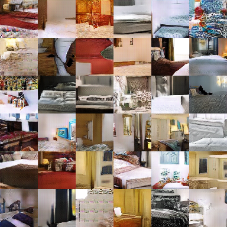 |

### WGAN

Arjovsky, Martin, Soumith Chintala, and Léon Bottou. "Wasserstein gan." arXiv preprint arXiv:1701.07875 (2017).

- The samples from WGAN are not that impressive - compared to the very impressive theory
- Also no specific network structure proposed, so DCGAN architecture was used for experiments
- In the [author's implementation](https://github.com/martinarjovsky/WassersteinGAN), they used higher n_critic in the early stage of training and per 500 iterations

|                   30k                   |                W distance                |
| :-------------------------------------: | :--------------------------------------: |
| 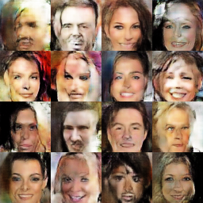 | 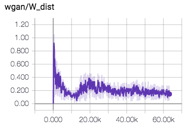 |

|                  LSUN                   |
| :-------------------------------------: |
|                  230k                   |
| 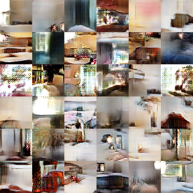 |

### WGAN-GP

Gulrajani, Ishaan, et al. "Improved training of wasserstein gans." arXiv preprint arXiv:1704.00028 (2017).

- I tried two network architectures, which are DCGAN architecture and ResNet architecture in appendix C
- ResNet has more complicated architecture and better performance than DCGAN architecture
- The interesting thing is that the visual quality of samples improves very quickly (ResNet WGAN-GP has best samples on 7k iterations) and it gets worse when continue training
- According to DRAGAN, constraints of WGAN are too restrictive to learn good generator

|            DCGAN architecture            |           ResNet architecture            |
| :--------------------------------------: | :--------------------------------------: |
|                   30k                    |           7k, batch size = 64            |
|  |  |

|                   LSUN                   |
| :--------------------------------------: |
|        100k, ResNet architecture         |
| 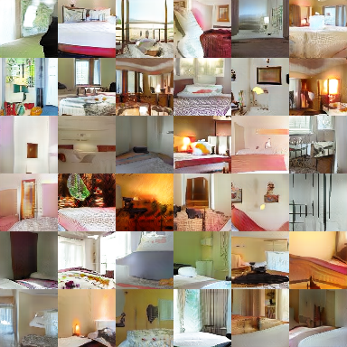 |

#### Face collapse phenomenon

WGAN-GP was collapsed more than other models when the iteration increases.

**DCGAN architecture**

|                   10k                    |                   20k                    |                   30k                    |
| :--------------------------------------: | :--------------------------------------: | :--------------------------------------: |
|  | 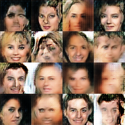 |  |


**ResNet architecture**

ResNet architecture showed the best visual quality sample in the very early stage, 7k iteration in my criteria. This maybe due to the residual architecture.

batch_size=64.

|                    5k                    |                    7k                    |                   10k                    |                   15k                    |
| :--------------------------------------: | :--------------------------------------: | :--------------------------------------: | :--------------------------------------: |
|  |  |  |  |
|                   20k                    |                   25k                    |                   30k                    |                   40k                    |
| 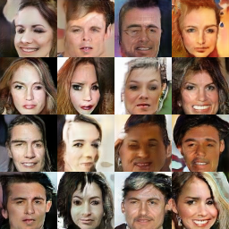 |  | 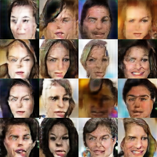 |  |

Regardless of the face collapse phenomenon, the Wasserstein distance decreased steadily. It should come from that the critic (discriminator) network failed to find the supremum and K-Lipschitz function.

|            DCGAN architecture            |           ResNet architecture            |
| :--------------------------------------: | :--------------------------------------: |
| 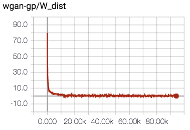 |  |
| 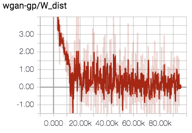 | 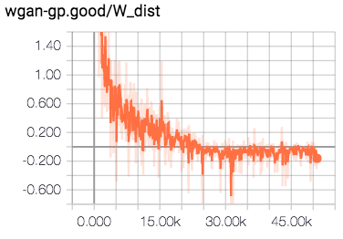 |

The plots in the last row of the table are just expanded version of the plots in the second row.

It is interesting that W_dist < 0 at the end of the training. This indicates that E[fake] > E[real] and, in the point of original GAN view, it means the generator dominates the discriminator. 

### BEGAN

Berthelot, David, Tom Schumm, and Luke Metz. "Began: Boundary equilibrium generative adversarial networks." arXiv preprint arXiv:1703.10717 (2017).

- The best model that generates samples with the best visual quality as far as I know
- It also showed the best performance in this project
  - Even though optional improvements was not implemented (section 3.5.1 in the paper)
- However, the samples generated by BEGAN give a slightly different feel from other models - it seems like disappearing details.
- So I just wonder what the results are for different datasets

batch_size=16, z_dim=64, gamma=0.5.

|                   30k                    |                   50k                    |                   75k                    |
| :--------------------------------------: | :--------------------------------------: | :--------------------------------------: |
| 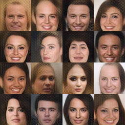 |  |  |

|         Convergence measure M         |
| :-----------------------------------: |
|  |

<!-- #### Speck-like artifacts phenomenon

As you can see above results, the samples of BEGAN has speckle artifacts. It can be reduced by adjusting gamma.

| gamma=0.3 | gam  |
| --------- | ---- |
|           |      | -->


BEGAN in the LSUN datset works terribly. Not only severe mode-collapse was observed, but also generated images were not realistic.

|                   LSUN                   |                   LSUN                   |
| :--------------------------------------: | :--------------------------------------: |
|                   100k                   |                   150k                   |
| 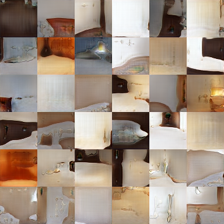 | 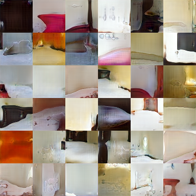 |
|                   200k                   |                   250k                   |
| 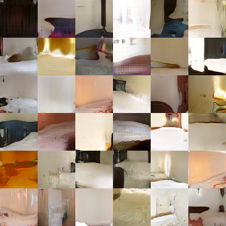 | 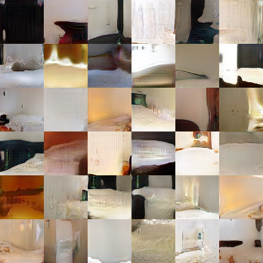 |


#### Image-whitening phenomenon

* The images become whity and cloudy as the learning progresses. I don't know if it is right to express, but it certainly does.
* This phenomenon has been seen in CycleGAN before. CycleGAN is based on LSGAN, but LSGAN does not have this whitening phenomenon.

same hyperparameters, only difference is gamma=0.4

|                   50k                    |                   100k                   |                   150k                   |
| :--------------------------------------: | :--------------------------------------: | :--------------------------------------: |
|  |  |  |
|                   200k                   |                   250k                   |                   290k                   |
|  |  |  |

(There is no particular reason why the last experiment is 290k instead of 300k...)

I also tried to reduce speck-like artifacts as suggested in [Heumi/BEGAN-tensorflow](https://github.com/Heumi/BEGAN-tensorflow/), but it did not go away. In spite of gamma=0.4, you can still see speck-like artifacts in the above experiments. 


### DRAGAN

Kodali, Naveen, et al. "How to Train Your DRAGAN." arXiv preprint arXiv:1705.07215 (2017).

- Different with other papers, DRAGAN was motivated from the game theory for improving performance of GAN
- This approach through the game theory is highly unique and interesting
- But, IMHO, there is not much real contribution. The algorithm is similar to WGAN-GP

|            DCGAN architecture            |
| :--------------------------------------: |
|                   120k                   |
| 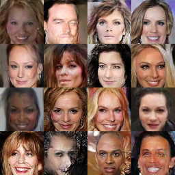 |

The original paper has some bugs. One of those is image x is pertured only positive-sided. I applied two-sided perturbation as the author admitted this bug on the [GitHub](https://github.com/kodalinaveen3/DRAGAN).

|                   LSUN                   |
| :--------------------------------------: |
|                   200k                   |
| 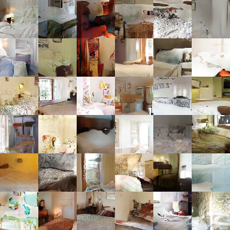 |


## Conclusion

- BEGAN showed the best performance
  - But it works terrible for LSUN dataset
  - I wonder if it works great only for face datasets and why
- The results from WGAN and WGAN-GP were not as impressive as its beautiful theory
- It is difficult to rank models except BEGAN due to the lack of quantitative measure. The visual quality of generated samples from each model seemed similar.
- Conversely speaking, there have been a lot of GANs since DCGAN, but there is not a lot of significant improvement in visual quality (except for BEGAN) 🤔🤔


## Usage

Download CelebA dataset:

```
$ python download.py celebA
$ python download.py lsun
```

Convert images to tfrecords format:   
Options for converting are hard-coded, so ensure to modify it before run `convert.py`. In particular, LSUN dataset is provided in LMDB format.

```
$ python convert.py
```

Train:   
If you want to change the settings of each model, you must also modify code directly.

```
$ python train.py --help
usage: train.py [-h] [--num_epochs NUM_EPOCHS] [--batch_size BATCH_SIZE]
                [--num_threads NUM_THREADS] --model MODEL [--name NAME]
                --dataset DATASET [--renew]

optional arguments:
  -h, --help            show this help message and exit
  --num_epochs NUM_EPOCHS
                        default: 20
  --batch_size BATCH_SIZE
                        default: 128
  --num_threads NUM_THREADS
                        # of data read threads (default: 4)
  --model MODEL         DCGAN / LSGAN / WGAN / WGAN-GP / EBGAN / BEGAN /
                        DRAGAN
  --name NAME           default: name=model
  --dataset DATASET     CelebA / LSUN
  --renew               train model from scratch - clean saved checkpoints and
                        summaries
```

Monitor through TensorBoard:

```
$ tensorboard --logdir=summary/dataset/name
```

Evaluate (generate fake samples):

```
$ python eval.py --help
usage: eval.py [-h] --model MODEL [--name NAME] --dataset DATASET
               [--sample_size SAMPLE_SIZE]

optional arguments:
  -h, --help            show this help message and exit
  --model MODEL         DCGAN / LSGAN / WGAN / WGAN-GP / EBGAN / BEGAN /
                        DRAGAN
  --name NAME           default: name=model
  --dataset DATASET     CelebA / LSUN
  --sample_size SAMPLE_SIZE, -N SAMPLE_SIZE
                        # of samples. It should be a square number. (default:
                        16)
```


### Requirements

- python 2.7
- tensorflow >= 1.2 (verified on 1.2 and 1.3)
- tqdm
- (optional) pynvml - for automatic gpu selection

## Similar works

- https://ajolicoeur.wordpress.com/cats/
- [wiseodd/generative-models](https://github.com/wiseodd/generative-models)
- [hwalsuklee/tensorflow-generative-model-collections](https://github.com/hwalsuklee/tensorflow-generative-model-collections)
- [sanghoon/tf-exercise-gan](https://github.com/sanghoon/tf-exercise-gan)
- [YadiraF/GAN_Theories](https://github.com/YadiraF/GAN_Theories)


