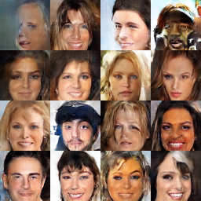
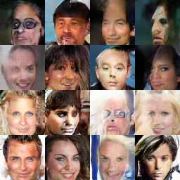
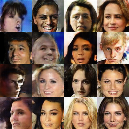
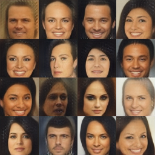
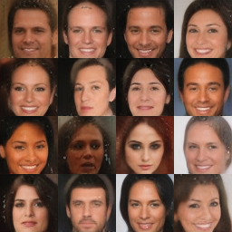

# GANs comparison without cherry-picking

In this project, I implemented and compared some theoretical generative adversarial nets: DCGAN, EBGAN, LSGAN, WGAN, WGAN-GP, BEGAN, and DRAGAN. I implemented the structure of model equal to the structure in paper and compared it on the CelebA dataset.


- 비슷한 레포가 몇개 있지만, 여기서는 최대한 논문의 구조를 그대로 구현하려 노력함
- 물론 100% 그대로 재현한 건 아님. 디테일한 부분은 생략했고 - 예를들면 weight init - 논문에서 구조가 정확히 안 나온 부분 등은 임의로 구현함
- 큰 구조는 동일하게 맞추었기는 하지만 GAN 이 파라메터에 민감하여 사소한 부분에서도 결과 차이가 날 수 있다는 점은 생각하고 볼 것

[TOC]

## ToDo

- LSUN dataset
- flexible input shape
- multiple results show on tensorboard 

## Features

- Model structure is copied from each paper
    - But some details are ignored
    - I admit that a little details make great differences in the results due to the very unstable GAN training
- Just done experiments for some questions, but not done tuning details
- Well-structured project - is my goal at the start, but the result is not satisfactory :(
    - TensorFlow queue runner is used for inpue pipeline
    - Single trainer (and single evaluator) - multi model structure
    - Logs in training and configuration are recorded on the TensorBoard

### Similar works

- [wiseodd/generative-models](https://github.com/wiseodd/generative-models)
- [hwalsuklee/tensorflow-generative-model-collections](https://github.com/hwalsuklee/tensorflow-generative-model-collections)
- [sanghoon/tf-exercise-gan](https://github.com/sanghoon/tf-exercise-gan)
- [YadiraF/GAN_Theories](https://github.com/YadiraF/GAN_Theories)
- https://ajolicoeur.wordpress.com/cats/

## Models

The family of conditional GANs are excluded (CGAN, acGAN, SGAN, and so on).

- DCGAN
- LSGAN
- WGAN
- WGAN-GP
- EBGAN
- BEGAN
- DRAGAN

## Results

- 실험은 전부 CelebA, 64x64 에 대해 수행됨
- CelebA 데이터셋은 202599 개로 구성되어 있고, batch size = 128 로 돌리면 15.8k 스텝이 1epoch 임
- 대부분 30k step (약 2epoch) 정도에서 수렴하였음. 여려 스텝에서의 샘플 결과를 보고 제일 좋은 걸 골라서 보여주는거임. (즉 G 를 pick 함. generated sample 을 pick 한 건 아니고.)
- default batch size 128, z_dim 100 (from DCGAN)

### DCGAN

- 네트워크 구조가 가장 간단함
- G 의 lr 을 조정했을 때 더 좋은 결과가 나옴
  - 아마 더 디테일하게 조정하면 더 좋은 결과를 볼 수 있지 않을까 싶음
  - https://ajolicoeur.wordpress.com/cats/ 에서는 5e-5 for D, 2e-4 for G 를 제안함 (for 64x64)

DCGAN.origin vs. DCGAN.G1e-3

|                G_lr=2e-4                 |                G_lr=1e-3                 |
| :--------------------------------------: | :--------------------------------------: |
|                   50k                    |                   30k                    |
|  |  |

G_lr 을 높게 주는 게 더 결과가 좋음. 대신 G 가 팡팡 튀어서 모델이 collapsed 되는 경우가 발생함. 위 프로젝트에서 제안한대로 G 를 높이는 게 아니라 D 를 낮추는 방식을 쓴다면 좀 더 안정적이면서 예쁜 모델을 학습할 수 있을 듯.

### EBGAN

- 개인적으로 좋아하는 논문 - energy concept 이 매력적
- 다만 딱히 energy-based 라고 할만한 점이 없다는 비판도 있긴 함
- 아무튼 결과는 꽤 괜찮음 
- pt regularizer 의 효용에 대해 좀 의문이 있음 (weight=0 으로 줘도 점점 줄어듬)
  - 나는 pt weight = 0 으로 하면 mode collapse 가 발생하고 pt regularizer 가 이를 방지할거라고 생각했으나 별로 그런 느낌이 없는듯함 

ebgan.pt vs. ebgan.nopt

|             pt weight = 0.1              |                No pt loss                |
| :--------------------------------------: | :--------------------------------------: |
|                   30k                    |                   30k                    |
|  |  |

pt 를 쓴게 더 결과가 좋긴 함

근데 pt 를 쓰는게 mode collapse 를 잡기 위함인데 그런 효과는 잘 모르겠음


### LSGAN

- 특이하게 LSGAN 에서는 z_dim 을 크게 씀: 1024
- 오히려 z_dim=100 일때 결과가 더 좋았음 - 미세하게.

LSGAN.100 vs. LSGAN.1024


|                z_dim=100                 |                z_dim=1024                |
| :--------------------------------------: | :--------------------------------------: |
|                   30k                    |                   30k                    |
|  |  |


### WGAN

- 이론적인 논문이라서 결과가 엄청 좋지는 않음
- 네트워크 구조도 특별히 제안하지 않음 => DCGAN architecture

|               30k                |
| :------------------------------: |
|  |


### WGAN-GP

- DCGAN architecture / appendix C 의 ResNet architecture
- resnet 결과가 더 좋은데 기대만큼의 성능향상이 나오지는 않음
  - 특이한 점은 굉장히 빨리 수렴하고 더 학습하면 결과가 나빠짐
  - skip-connection 의 영향으로 보임
- DRAGAN 논문에서는 WGAN(-GP) 의 constraint 가 너무 restrict 해서 poor G 를 학습한다고 함

wgan-gp.dcgan vs. wgan-gp.resnet

|            DCGAN architecture            |           ResNet architecture            |
| :--------------------------------------: | :--------------------------------------: |
|                   30k                    |           7k, batch size = 64            |
|  |  |


wgan-gp.resnet 은 낮은 에퐄에서 좋은 결과를 보임

|                    5k                    |                    7k                    |                   10k                    |                   15k                    |
| :--------------------------------------: | :--------------------------------------: | :--------------------------------------: | :--------------------------------------: |
|  |  |  |  |
|                   20k                    |                   25k                    |                   30k                    |                   40k                    |
|  |  |  |  |


### BEGAN

- celebA 에 대해서는 결과가 좋음 (사람이 보기에)
  - optional improvement 부분은 구현하지 않았음에도!
- 그러나 디테일이 없어지는듯한 느낌이 있음
- Q. LSUN 등 다른 데이터셋에 대해서도 결과가 잘 나올까? - ToDo

batch size = 16, z_dim=64

|                30k                 |                50k                 |                75k                 |
| :--------------------------------: | :--------------------------------: | :--------------------------------: |
|  |  |  |


### DRAGAN

- Game theory 에서의 접근이 굉장히 흥미로움
- DCGAN architecture
- 동일한 아키텍처인 DCGAN, WGAN, WGAN-GP 와 비교해봤을 때 결과가 좋음
  - hyperparam tuning 한 DCGAN 과는 비슷한 느낌
- 특히 WGAN-GP 와 알고리즘이 비슷 (WGAN-GP + DCGAN 느낌)
- 논문에 따르면 WGAN-GP 는 restriction 이 너무 강하여 poor G 를 생성한다고 함

|                 30k                  |
| :----------------------------------: |
|  |


## Conclusion

- BEGAN이 제일 인상적이긴 하나 LSUN 에서도 그럴지 궁금
  - BEGAN 은 learning rate decay 등등 implementation 자체가 신경써서 되어 있기는함 - 즉 엔지니어링빨이라고 할수도
  - 그렇다 쳐도 결과가 매우 인상적
- DCGAN도 learning rate 을 잘 조절해주면 좋은 결과를 보임
  - BEGAN 을 제외하고 제일 좋은 결과인 것 같기는 한데 다른 모델들은 tuning 을 전혀 안했기때문에 무조건 그렇다고 할 순 없음
- DRAGAN 도 꽤나 인상적

## Usage

CelebA dataset 을 다운로드
```
$ python download.py celeba
```
TFRecords format 으로 변경
```
$ python convert.py
```
학습
```
$ python train.py --model model --name name
```
Tensorboard

```
$ tensorboard --logdir=summary/name
```

Evaluation

```
$ python eval.py --model model --name name
```


### Requirements

- python 2.7
- tensorflow 1.2
- tqdm
- (optional) pynvml - for auto gpu selection

